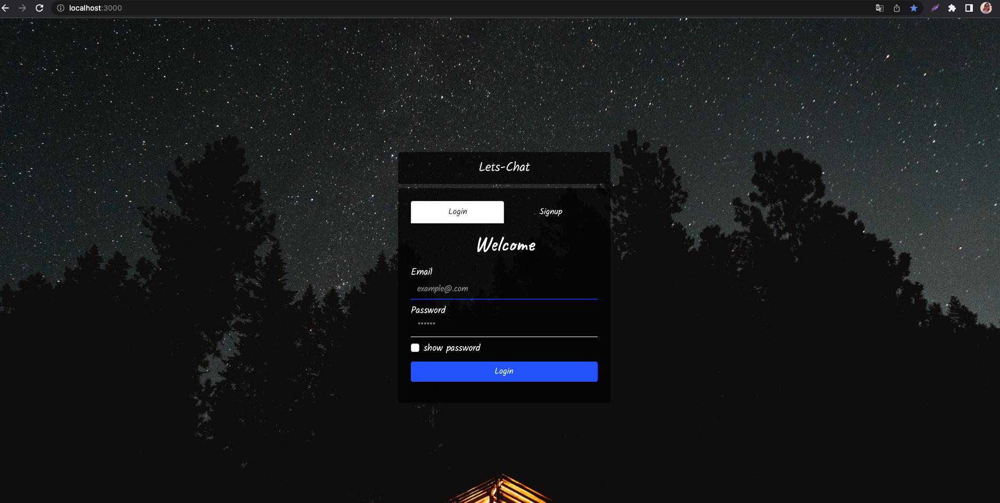
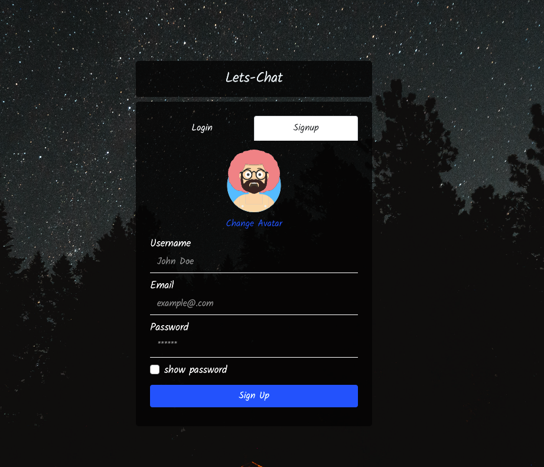
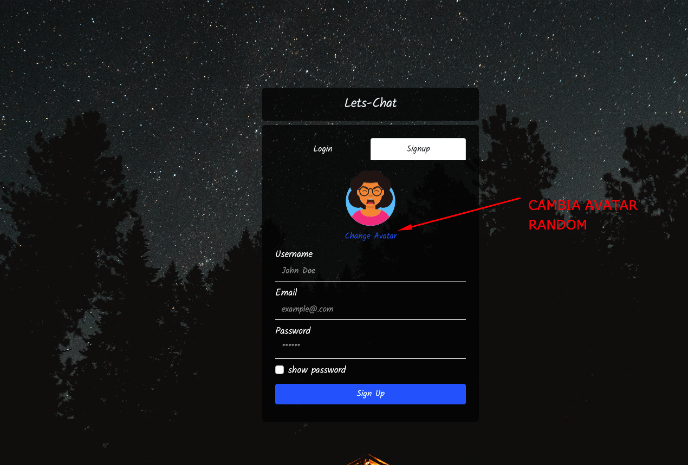
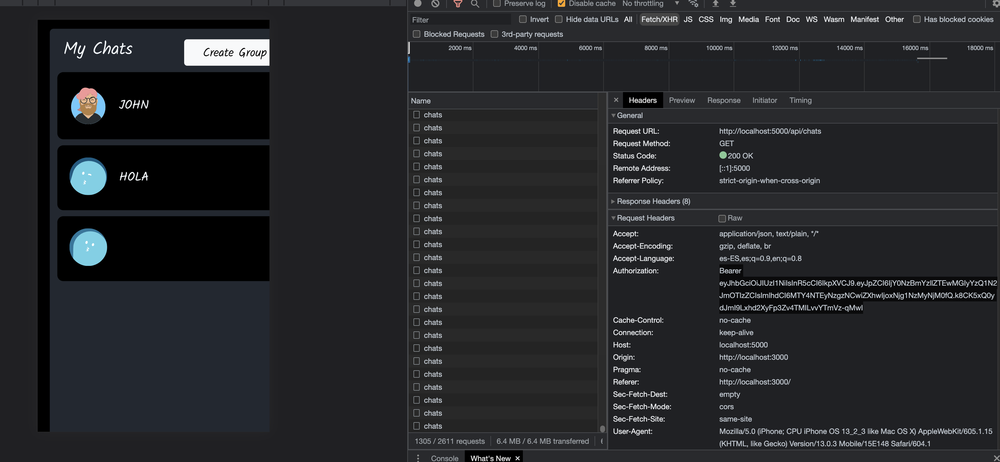
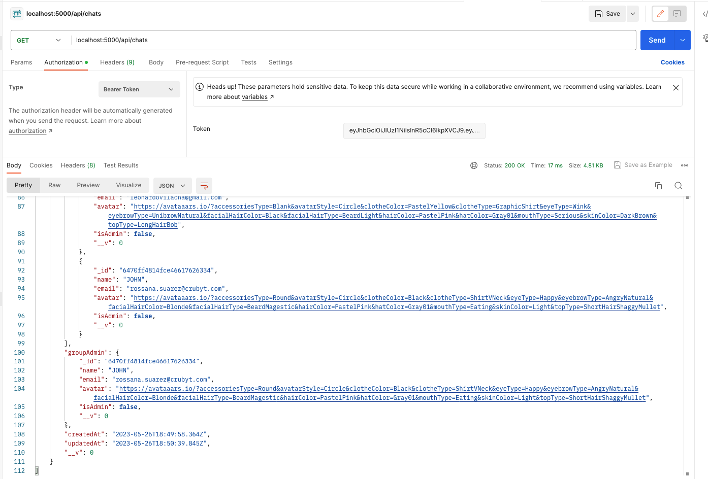

# LAB-07

## Despliegue y acceso de la Aplicación Lets-Chat

Let's Chat _VERSION BETA_ es una aplicación que incluye un Frontend escrita en React y un Backend escrita en nodejs que utilizando una base de datos MongoDB nos posibilita la autenticación de usuarios y creación de salas de chats.

Vamos a realiza el despliegue y acceso a esta aplicación teniendo en cuenta los siguientes aspectos:

* La imagen deben construirla para lograr el despliegue de Let's Chat Frontend y Backend y para desplegar mongoDB utilizaremos la imagen `mongo`.
* Al crear el despliegue de Let's Chat podemos poner varias replicas, pero el despliegue de la base de datos, sólo creará una replica.
* El puerto en el que responde la aplicación es Frontend en el 3000 y Backend en el 5000. La base de datos utiliza el puerto 27017.
* Vamos acceder desde el exterior a la aplicación. Sin embargo, no es necesario acceder desde el exterior a la base de datos.

### info adicional:

- El Backend requiere cierta información se encuentra en config.env
- El Frontend al momento de logearse o crear un usuario genera un token JWT podemos tomarlo alli para generar el token
- El Frontend y Backend con node >= 14

### Como funciona:

### Realiza los siguientes pasos:

1. Crea los archivos necesarios para crear los recursos en tu cluster de Kubernetes para desplegar esta aplicación.

Para superar el desafio deberás entregar en un unico repositorio de github en formato [markdown](https://docs.github.com/es/get-started/writing-on-github/getting-started-with-writing-and-formatting-on-github/basic-writing-and-formatting-syntax):

1. Los archivos yaml que has creado.
2. Una imagen donde se vea el acceso desde un navegador web a la aplicación usando la ip del nodo master y el puerto asignado al Service (**imagen1.jpg**).
3. Una imagen donde se vea el acceso desde un navegador web a la aplicación usando el nombre que hemos configurado en el recurso Ingress (**imagen2.jpg**).
4. Diseñar Arquitectura de objetos de kubernetes pueden usar [k8sviz](https://github.com/mkimuram/k8sviz)
